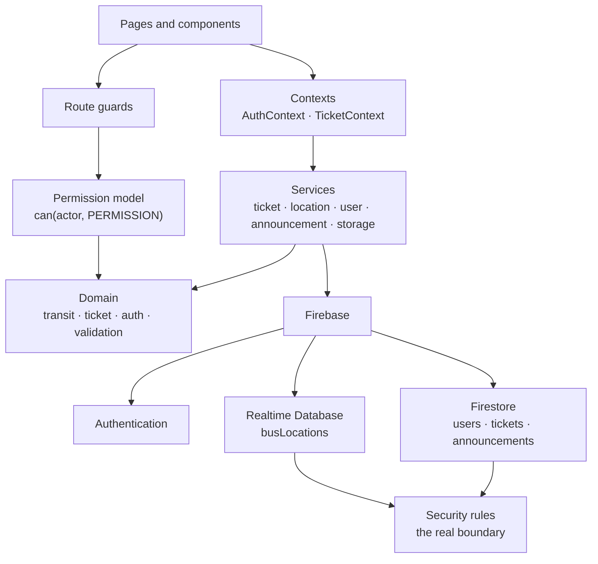
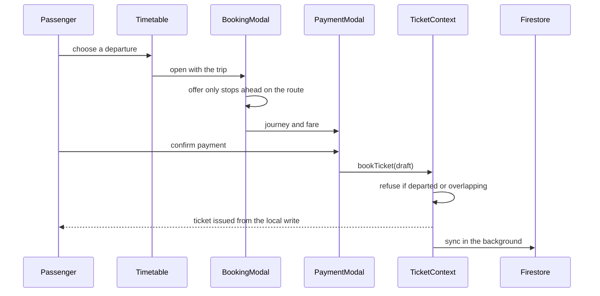
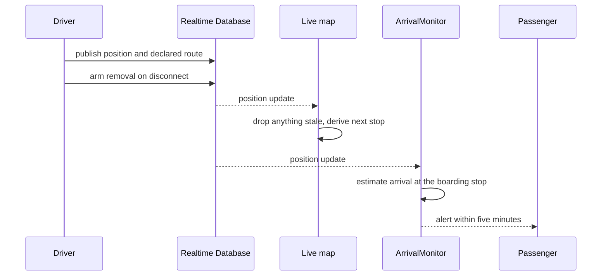

# BRT Smart Bus Service

A transit web application for the Raipur to Naya Raipur BRTS corridor: plan a journey
against the published timetable, check the official fare between any two stops, book a
ticket, and follow buses that drivers are actively sharing.

[](https://github.com/Mukund934/BRT-Bus-Service-3/actions/workflows/ci.yml)


**Live:** https://bus-service-lyart.vercel.app/


## Why this exists

Riders on the Raipur to Naya Raipur corridor had no single place to answer three ordinary
questions: when does my bus leave, what will it cost, and where is it now. Timetables and
the fare chart are published as documents; live positions were not published at all.

This project turns those documents into something usable at a bus stop. The transit data is
not invented for a demo — routes, stops, the 39-stop network and the fare matrix come from
the official Tatpar BRTS sources, and the
[fare chart is included in the repository](public/docs/FareChart.pdf) so any price shown can
be checked against it.

**Who it is for:** passengers planning or taking a journey, drivers sharing their position
during a shift, and an operator publishing service notices.

**What makes it different from a typical CRUD portfolio app:**

- Official transit data lives in version control as typed modules, not as editable rows. A
  fare shown to a passenger is traceable to a published document.
- Authorization is enforced twice — in the browser for what to render, and in Firebase
  security rules for what is actually permitted. Only the second is treated as a boundary.
- Nothing the app cannot verify is displayed. Where data does not exist, the interface says
  so instead of estimating.

---

## Features

### Journeys and fares

| | |
|---|---|
| **Journey planner** (`/plan`) | Pick an origin and destination; departures come from the published timetable and prices from the official fare chart. Weekday and weekend services differ and are handled separately. |
| **Fare centre** (`/fares`) | The fare between any two stops, plus the full published chart. Unpriced pairs are reported as unavailable rather than estimated. |
| **Timetable** (`/timetable`) | Weekday and weekend departures for routes 101 and 102, bookable only on a day the service actually runs. |
| **Route explorer** (`/routes`) | Every route in the official network, the stops it serves, interchanges, and which stops have published departures. |
| **Nearby places** (`/nearby`) | Destinations across Nava Raipur with the nearest stop for each, linked through to planning, routes and fares. |

### Ticketing

- Booking with a simulated UPI QR payment step, refused for a bus that has already departed
  or a journey overlapping a ticket already held.
- A virtual ticket carrying a scannable QR payload, whose status follows the clock through
  Active, Boarding Soon, In Transit and Completed without a refresh.
- Tickets are stored in Firestore and cached on the device, so a ticket already synced
  **opens with no connection**. A booking or cancellation made offline is reconciled on the
  next sync.
- Ticket history with filtering, cancellation, and per-passenger totals.

### Live tracking

- Drivers declare the route they are running and share their position for the shift.
- The public map shows each vehicle's route, the stop it reaches next and where it
  terminates — derived from position and route order, never inferred from movement.
- A bus that stops reporting is retired from the map on a timer rather than lingering, and
  the server clears a driver's position if their connection drops.
- Positions publish coordinates and an opaque label such as `BUS-4K2P`. No driver name,
  email address or account id is ever published.

### Passenger experience

- Arrival alerts when a reporting bus is within five minutes of your boarding stop, in-app
  and as a browser notification, with permission requested only when you switch them on.
- Alerts can be turned off from the dashboard.
- Help centre (`/help`) explaining how booking, fares, ticket states, tracking and data
  handling actually work — every figure read from the domain rather than written out, so the
  page cannot drift from the code.
- Email and Google sign-in, and password recovery that reports the same outcome whether or
  not an account exists, so the form cannot be used to discover registered addresses.

### Admin and operations

- User roster with search, role assignment, and a capped read that reports when it truncated
  rather than showing a partial list as if it were complete.
- Announcement authoring — notices published here appear to every visitor, with severity
  driving prominence; only a major disruption interrupts a screen reader.
- Fleet status joining the driver roster to live positions: who is on shift, on which route,
  and when they last reported.

---

## Screenshots

Not yet captured. The pages worth showing are Home, Journey Planner, Route Explorer, Nearby
Places, Live Map, Passenger Dashboard, Admin Panel and Help.

---

## Tech stack

| Layer | Choices |
|---|---|
| **Frontend** | React 18, TypeScript (strict), Vite 5 |
| **Routing** | React Router 6, route-level `React.lazy` |
| **Styling** | Tailwind CSS, Radix UI primitives (dialog, toast, tooltip), lucide-react |
| **State** | React Context — `AuthContext` for session and role, `TicketContext` for tickets |
| **Validation** | zod, at every trust boundary |
| **Auth** | Firebase Authentication (email/password, Google) |
| **Database** | Cloud Firestore — users, tickets, announcements |
| **Realtime** | Firebase Realtime Database — live bus positions |
| **Other** | qrcode.react, sonner, OpenStreetMap embed, Browser Notification API |
| **Testing** | Vitest, Testing Library, user-event, jsdom, v8 coverage |
| **Tooling** | ESLint (typescript-eslint), GitHub Actions, Vercel |

---

## Architecture

Pages compose components; components ask contexts for state; contexts call services;
services are the only code that talks to Firebase. The domain layer underneath is pure
TypeScript with no React and no network, which is why transit rules, fares and the ticket
lifecycle can be tested without mounting anything.



### Booking a ticket



### Live tracking and alerts



---

## Project structure

```
src/
  domain/        pure rules, no React and no network
    transit/     routes, stops, timetable, official fare matrix
    ticket/      lifecycle, status engine, conflicts, selectors
    auth/        permission model and safe error messages
    validation/  zod schemas for every trust boundary
  services/      the only code that talks to Firebase or browser storage
  contexts/      AuthContext (session, role) and TicketContext
  components/    UI, plus a11y/ routing/ dashboards/ ui/
  pages/         one file per route, lazily loaded
  constants/     tuning values: polling, arrival rules, remote paths
  test/          mirrors the above, plus integration/ and helpers/
```

Rules and hosting configuration live at the root: `firestore.rules`,
`database.rules.json`, `firebase.json`, `vercel.json`.

---

## Engineering notes

**Types.** Strict TypeScript throughout. Stops and routes are typed against the registries,
so a ticket cannot reference a stop that does not exist.

**Validation.** Anything crossing a trust boundary — browser storage, Firestore, the
Realtime Database, a form field — is parsed with zod before use. A corrupt stored ticket
costs the passenger that one ticket rather than their whole history.

**Permissions.** Every privileged capability is named once in
`src/domain/auth/permissions.ts` and asked for with `can(actor, PERMISSION)`. A null actor
holds nothing, so privileged UI cannot flash before the role resolves.

**Error handling.** Raw Firebase errors carry project ids and rule paths, so they are mapped
to safe messages before display. Sign-in and password reset deliberately collapse
distinguishable failures into one message, so neither can be used as an
account-enumeration oracle.

**Performance.** Route-level code splitting; Firestore (~396 kB) and the Realtime Database
(~192 kB) load on demand, so a visitor reading the timetable downloads neither. Derived
views are memoized, and the hero image declares its intrinsic size and a fetch-priority
hint.

**Accessibility.** Labelled controls, a skip link, focus moved deliberately after route
changes and dialogs, `aria-pressed` on toggles, live regions for announcements, and status
conveyed by text rather than colour alone.

**State.** Two contexts, no state library. Tickets render from the cached copy first so a
ticket opens offline, then reconcile with the server.

---

## Quality

| | |
|---|---|
| Tests | **1,215**, across 80 files, plus 116 against the Firebase emulator |
| Coverage | **97.1% lines**, 90.4% branches, 90.8% functions |
| Thresholds | 95 lines / 86 branches / 83 functions — a ratchet set just below actuals, raised deliberately |
| Typecheck | clean |
| Lint | 0 errors |

Coverage is measured where decisions live: domain, services, contexts, components and pages.

---

## Getting started

**Requirements:** Node 20 or 22.

```bash
git clone https://github.com/Mukund934/BRT-Bus-Service-3.git
cd BRT-Bus-Service-3
npm install
cp .env.example .env
```

Fill `.env` from **Firebase console → Project settings → General → Your apps → SDK setup**.

> These values are **not secrets**. Firebase web configuration is compiled into the
> JavaScript bundle every visitor downloads and can be read from any deployed Firebase app.
> What protects the data is the security rules below, which run on Google's servers and
> cannot be bypassed by a modified client.

```bash
npm run dev
```

Then open http://localhost:8080.

| Command | Does |
|---|---|
| `npm run dev` | development server |
| `npm run build` | production build |
| `npm run preview` | serve the production build |
| `npm run lint` | ESLint |
| `npm run typecheck` | TypeScript, no emit |
| `npm test` | test suite |
| `npm run test:coverage` | suite with coverage report |
| `npm run test:rules` | security rules against the Firebase emulator (needs JDK 21+) |
| `npm run test:rules:db` | just the Realtime Database rules, one emulator at a time |
| `npm run test:rules:firestore` | just the Firestore rules, one emulator at a time |

`test:rules` starts three emulators at once, each a JVM. On a machine short of
memory that fails to start rather than failing a test — the exit says
`3221225786`, which is a process killed on startup, not a rule that broke. The
two split commands run one emulator at a time and cover the same ground.
| `npm run verify` | everything CI runs, in the same order |

---

## 🧪 Testing

```bash
npm test              # run the suite once
npm run test:watch    # re-run on change
npm run test:coverage # suite + coverage report
npm run verify        # everything CI runs, in the same order
```

Coverage lands in `coverage/`; open `coverage/index.html` for the line-by-line view.

### Philosophy

Tests here protect **behaviour**, not implementation. A test that breaks when a
component is refactored but the user experience is unchanged is a liability, so
the suite avoids snapshots of markup, shallow rendering, and assertions about
internal state.

Practically that means:

- **Query the way a user finds things** — by role, label and visible text.
  `getByRole("button", { name: /proceed to pay/i })` breaks only if the button
  genuinely stops being reachable.
- **Drive with `user-event`, not `fireEvent`** — it dispatches the same event
  sequence a browser does, so a click on a disabled or covered element fails
  like it would in real life.
- **Coverage is measured only where decisions live** (`domain`, `services`,
  `contexts`, `components`). Including presentational pages would raise the
  percentage without telling anyone whether booking works.
- **Thresholds are a ratchet, not a target.** They sit just below what the suite
  achieves so a regression fails CI; they are raised deliberately.

### Layout

| Path | What lives there |
|---|---|
| `src/test/domain/` | Pure business rules: fares, timetable, ticket lifecycle, selectors |
| `src/test/services/` | Persistence, booking rules, user records, alerts, location |
| `src/test/contexts/` | Provider wiring: sign-in, sign-out, account switching, polling |
| `src/test/components/` | UI behaviour and accessibility |
| `src/test/integration/` | Whole user journeys through real pages |
| `src/test/helpers/` | Shared render helper, data factories, mocks |

### Mocking

Firebase is never loaded in tests. `src/test/helpers/firebase.ts` is the single
place that defines how it behaves — a controllable auth listener, an in-memory
Firestore document store and an opt-in Realtime Database node tree, so services
run their real logic against something that acts like a database rather than
against per-call stubs.

Tests that mount the auth provider but are not about user records mock
`userService` via `src/test/helpers/userService.ts`, which also lets them choose
a role outright.

Anything time-dependent freezes the clock. The timetable's first departure is
6:25 AM, so a suite using the real clock would quietly pass in the morning and
fail in the evening.

---

## 🔄 Continuous Integration

`.github/workflows/ci.yml` runs on every push and pull request to `main`, across
Node 20 and 22. Each gate is a separate step, so a red run names what broke:

| Gate | Blocks merge on |
|---|---|
| `npm ci` | lockfile drift |
| `npm run typecheck` | any type error |
| `npm run typecheck:domain` | a domain module that needs the DOM or a path alias |
| `npm run lint` | any ESLint error |
| `npm run test:coverage` | a failing test **or** coverage below threshold |
| `npm run test:domain` | a domain test that only passes inside jsdom |
| `npm run build` | a broken production build |
| `npm run test:bundle` | an initial payload over budget, or a lazy chunk that stopped being lazy |
| `npm run test:rules` | a security rule Firebase's evaluator does not enforce the way it reads |

Coverage and the built `dist/` are uploaded as artifacts. Run the identical
sequence locally with `npm run verify`.

---

## 🔐 Security Model

Authorization is enforced in two independent places. The browser layer decides
what to render and which calls to attempt; the server layer decides what is
actually permitted. Only the second one is a security boundary.

| Layer | Where | What it does |
|---|---|---|
| Security rules | `firestore.rules`, `database.rules.json` | The real boundary. Runs on Google's servers. |
| Permission model | `src/domain/auth/permissions.ts` | Named capabilities per role, asked via `can(actor, PERMISSION)`. |
| Route guards | `src/components/routing/RouteGuards.tsx` | Keeps unauthorized users off privileged pages and blocks rendering until the role resolves. |
| Schema validation | `src/domain/validation/schemas.ts` | Everything from storage, Firestore, RTDB and forms is parsed before use. |

**Key invariants**

- A user may create and edit their own profile but can **never** set or change
  their own `role`. Role assignment is admin-only, enforced in `firestore.rules`.
- Listing the `users` collection is admin-only, so a signed-in passenger cannot
  enumerate every account.
- A passenger may only list their own tickets; the rule requires the query to be
  constrained to their own account.
- Announcements are world-readable but writable only by an administrator, with
  length and severity limits enforced in the rule as well as the client.
- Any collection without an explicit rule is denied by default.
- Driver positions publish **coordinates, a route and an opaque bus label only** —
  never a name or email address. `database.rules.json` rejects any other field.

### Deploying the rules

Rules in this repository do nothing until they are deployed. After changing
them:

```bash
npx firebase-tools deploy --only firestore:rules,database
```

### Testing the rules locally

```bash
npx firebase-tools emulators:start --only firestore,database
```

---

## Deployment

Deployed on [Vercel](https://bus-service-lyart.vercel.app/). `vercel.json` holds the SPA
rewrite and the security headers.

```bash
npm run build      # production build into dist/
npm run preview    # serve the build locally
```

**Security rules are not deployed by `npm run build`.** They ship separately, and the
application depends on them: without the Realtime Database rules a driver's position write
is rejected outright.

---

## Future improvements

- Progressive web app installability — needs 192×192 and 512×512 icons, which the
  repository does not yet contain.
- A published privacy policy and terms, which are deployment-specific.
- Weekend Route 101 timetable: five rows in the published source are internally
  inconsistent and are deliberately left as they are rather than reconstructed.
- Editing a display name from the account screen.
- React Router 7 migration, which clears two outstanding advisories currently mitigated in
  `RouteGuards.tsx`.

---

## Contributing

```bash
npm install
npm run verify     # all eight gates, in CI's order (test:rules needs JDK 21+)
```

`npm run verify` is exactly what CI runs, in the same order. Please keep it green, and add
tests that describe behaviour a user would notice.

---

## Authors

**Mukund Thakur** — [github.com/Mukund934](https://github.com/Mukund934) ·
[mukund.th04@gmail.com](mailto:mukund.th04@gmail.com)

**Dharmendra Dhruw** — [github.com/dharmendra23101](https://github.com/dharmendra23101)

---
